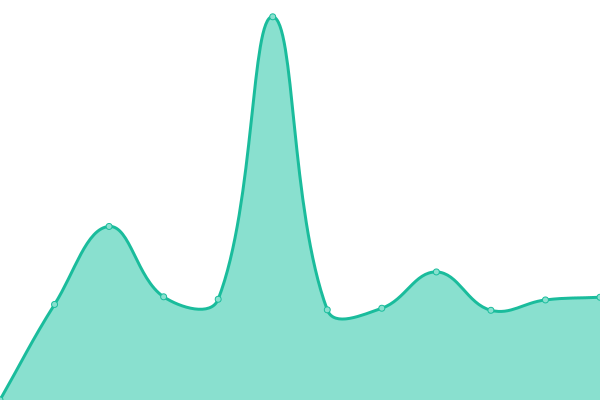

# [📈 实时状态](https://status.ldd.cc): <！ -实时状态- > **所有系统都可以正常运行**

This repository contains the open-source uptime monitor and status page for [卢东东](ldd.cc), powered by [Upptime](https://github.com/upptime/upptime).

With [Upptime](https://upptime.js.org), you can get your own unlimited and free uptime monitor and status page, powered entirely by a GitHub repository. We use [Issues](https://github.com/xjoylu/status/issues) as incident reports, [Actions](https://github.com/xjoylu/status/actions) as uptime monitors, and [Pages](https://status.ldd.cc) for the status page.

## [📈 Live Status](https://demo.upptime.js.org): <!--live status--> **所有系统都可以正常运行**

<!--start: status pages-->
<!-- This summary is generated by Upptime (https://github.com/upptime/upptime) -->
<!-- Do not edit this manually, your changes will be overwritten -->
<!-- prettier-ignore -->
| 链接 | 状态 | 历史 | 响应时间 | 正常运行时间 |
| --- | ------ | ------- | ------------- | ------ |
|  [卢东东](https://ldd.cc) | 🟩 正常运行 | [.yml](https://github.com/xJoyLu/status/commits/HEAD/history/.yml) | 

 744毫秒
     
 | 

<a href="https://status.ldd.cc/history/">99.64%</a>
    

|  [三义栈](https://3ez.cn) | 🟩 正常运行 | [.yml](https://github.com/xJoyLu/status/commits/HEAD/history/.yml) | 

 744毫秒
     
 | 

<a href="https://status.ldd.cc/history/">99.64%</a>
    

|  [序章官网](https://xuzh.com) | 🟩 正常运行 | [.yml](https://github.com/xJoyLu/status/commits/HEAD/history/.yml) | 

 744毫秒
     
 | 

<a href="https://status.ldd.cc/history/">99.64%</a>
    

|  [无所事事](https://wusuoshishi.com) | 🟩 正常运行 | [.yml](https://github.com/xJoyLu/status/commits/HEAD/history/.yml) | 

 744毫秒
     
 | 

<a href="https://status.ldd.cc/history/">99.64%</a>
    

|  [LCC](https://lcc.cc) | 🟩 正常运行 | [lcc.yml](https://github.com/xJoyLu/status/commits/HEAD/history/lcc.yml) | 

 943毫秒
     
 | 

<a href="https://status.ldd.cc/history/lcc">100.00%</a>
    

|  [PJ](https://peijin.cn) | 🟩 正常运行 | [pj.yml](https://github.com/xJoyLu/status/commits/HEAD/history/pj.yml) | 

 1848毫秒
     
 | 

<a href="https://status.ldd.cc/history/pj">99.64%</a>
    

<!--end: status pages-->

[**Visit our status website →**](https://status.ldd.cc)

## 📄 License

- Powered by: [Upptime](https://github.com/upptime/upptime)
- Code: [MIT](./LICENSE) © [Anand Chowdhary](https://anandchowdhary.com), supported by [Pabio](https://pabio.com)
- Data in the `./history` directory: [Open Database License](https://opendatacommons.org/licenses/odbl/1-0/)
